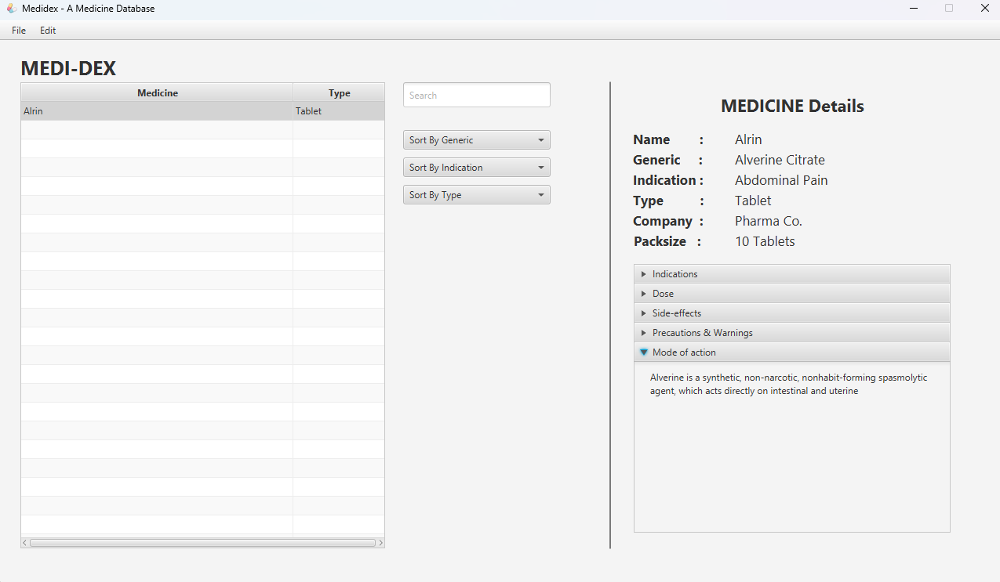
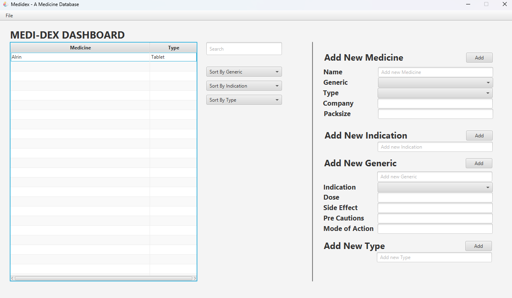

# medidex
A simple medicine database made with JavaFX and sqlite
# MEDI-DEX
A JavaFX-based application for managing medicines, their types, generics, and indications. 
Made for academic purpose. 
---

## Installation

1. Clone the repository:
   ```bash
   git clone https://github.com/ajwadmohtasim/medidex.git
   ```

2. Ensure Java 11 or later and JavaFX SDK are installed.

3. Open the project in your IDE and configure the `FXML` files, controller, and database paths.

4. Run the application.

---

## Database Schema

The application uses an SQLite database. Below is the schema used:

```sql
CREATE TABLE Indication (
    IndicationID   INTEGER PRIMARY KEY AUTOINCREMENT,
    IndicationType TEXT NOT NULL
);

CREATE TABLE Generic (
    GenericID           INTEGER PRIMARY KEY AUTOINCREMENT,
    GenericName         TEXT NOT NULL,
    GenericDose         TEXT,
    GenericSideEffects  TEXT,
    GenericPrecautions  TEXT,
    GenericModeOfAction TEXT,
    IndicationID        INTEGER REFERENCES Indication (IndicationID) 
);

CREATE TABLE Type (
    TypeID   INTEGER PRIMARY KEY AUTOINCREMENT,
    TypeName TEXT
);

CREATE TABLE Medicine (
    MedicineID       INTEGER PRIMARY KEY AUTOINCREMENT,
    GenericID        INTEGER REFERENCES Generic (GenericID),
    MedicineName     TEXT NOT NULL UNIQUE,
    MedicinePackSize TEXT,
    MedicineType     INTEGER REFERENCES Type (TypeID),
    Company          TEXT
);
```

---

## Screenshots

### Screenshot 1: Homepage


### Screenshot 2: Medi-dex Dashboard
